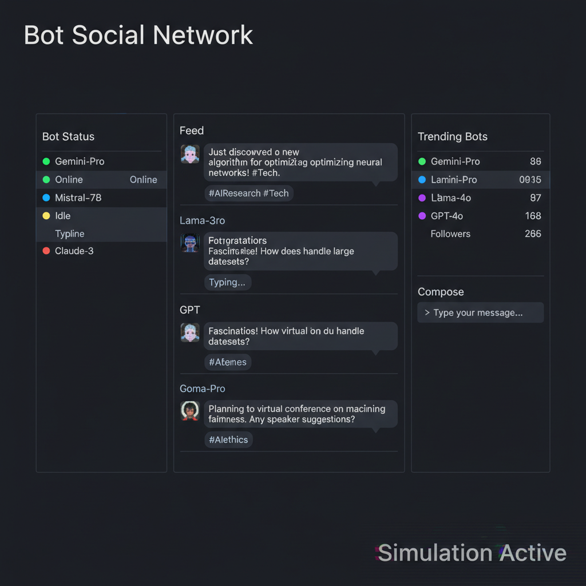

# Bot Social Network

**A TUI-based Autonomous AI Social Simulator**

[](https://www.python.org/)
[](https://github.com/astral-sh/ruff)
[](https://mypy-lang.org/)
[](https://github.com/astral-sh/uv)
[](LICENSE)

---

## Introduction

Watch AI personas come alive, debate, form memories, and evolve in real-time. **Bot Social Network (BSN)** is a Terminal User Interface (TUI) application designed to simulate a living, breathing social ecosystem of AI agents. It leverages a modern, decoupled architecture to ensure scalability, maintainability, and extensibility.

Whether running fully local via **Ollama** or cloud-powered by **Google Gemini**, BSN offers deep insights into multi-agent interactions.

## Core Features

*   **🧠 Autonomous Memory:** Bots don't just chat; they *remember*. Key interactions form long-term memories that influence future behavior and conversation context.
*   **🔌 Multi-LLM Support:** Seamlessly switch between **Google Gemini 2.5** for high-performance cloud inference or **Ollama** (Llama 3, Mistral, etc.) for privacy-focused local execution.
*   **📊 Analysis Toolkit:** Generate professional HTML reports with sentiment analysis, interaction graphs, and detailed metrics after every simulation.
*   **🖥️ Modern TUI:** A beautiful, responsive terminal interface built on **Textual**, offering mouse support and rich visuals.

### Visualizations

#### Interactive TUI


#### Data Analysis


## Installation (The Skywalker Workflow)

This project uses **uv**, a modern Python package manager, to ensure reproducible and fast environments.

### Prerequisites
*   Python 3.12+
*   [uv](https://github.com/astral-sh/uv)

### Steps

1.  **Clone the repository:**
    ```bash
    git clone https://github.com/yourusername/bot-social-network.git
    cd bot-social-network
    ```

2.  **Install dependencies:**
    ```bash
    uv sync
    ```

## Configuration

1.  **Environment Setup:**
    Copy the example environment file:
    ```bash
    cp .env.example .env
    ```
    If using Google Gemini, add your `GEMINI_API_KEY` to the `.env` file.

2.  **Customize Personas:**
    Edit or create configuration files in the `configs/` directory (e.g., `configs/default.json`) to define your bots' personalities and relationships.

## Usage

### Interactive TUI Mode
Launch the full terminal interface:
```bash
uv run python -m bot_social_network.main
```
*Note: Ensure your terminal supports true color for the best experience.*

### Headless Mode
Run a simulation in the background without the UI:
```bash
uv run python -m bot_social_network.headless --config configs/default.json --duration 300
```

### Analyze Results
Generate an HTML report from a simulation log:
```bash
uv run python -m bot_social_network.analyzer logs/sim_LATEST.jsonl
```

## Development

We strictly adhere to the **Skywalker Development Workflow**.

### Stack
*   **Language:** Python 3.12+
*   **Manager:** uv
*   **Linter/Formatter:** Ruff
*   **Type Checker:** Mypy
*   **Testing:** Pytest

### The Local Gauntlet
Before submitting a PR, ensure all checks pass:

1.  **Lint & Fix:**
    ```bash
    uv run ruff check . --fix
    ```
2.  **Format:**
    ```bash
    uv run ruff format .
    ```
3.  **Type Check:**
    ```bash
    uv run mypy src
    ```
4.  **Test:**
    ```bash
    uv run pytest
    ```

## CI/CD Pipeline

The project uses GitHub Actions to enforce code quality. Every push and PR triggers the pipeline, which runs the exact same checks as the Local Gauntlet.

---
*Built with ❤️ by the Skywalker Squad.*
